# Clinic Management System

## By Shahbaz Pasha

## Introduction
In today's fast-paced healthcare environment, efficient management of appointments is crucial for providing timely and effective patient care. This project helps to schedule appointments, reducing wait times and improving overall patient satisfaction. Through intuitive interfaces accessible via web or mobile devices, patients can book appointments at their convenience and check availability in real-time. For healthcare providers, the system offers robust features such as calendar synchronization. By embracing this technology, clinics can uphold their commitment to quality care and ensure a smoother healthcare experience for all stakeholders.

## Objective
1. Streamline the appointment booking process to reduce administrative workload and wait times for patients.
2. Ensure accurate scheduling and reduce scheduling conflicts through real-time availability checks and calendar synchronization.
3. Improve overall patient experience by offering convenient appointment booking options, reminders, and easy rescheduling capabilities.

## Program Implementation
This C++ program implements a simple clinic management system where patients can book appointments with a doctor.

### Classes:
#### 1. Clinic Class:
- **Attributes:**
  - `doctor`: Stores the name of the doctor.
  - `workinghours`: Constant string representing the doctor's working hours.
- **Methods:**
  - `getDoctorName()`: Returns the name of the doctor.
  - `showTimings()`: Displays the doctor's working hours.

#### 2. Doctor Class:
- **Attributes:**
  - `doc_fees`: Integer representing the consultation fee (500).
- **Methods:**
  - `getFees()`: Returns the consultation fee.
  - `bookAppointment()`: Currently an empty method, intended for future functionality related to booking appointments.

#### 3. Patient Class:
- **Attributes:**
  - `name`: String storing the patient's name.
  - `age`: Integer representing the patient's age.
  - `gender`: String indicating the patient's gender.
  - `contactNumber`: String holding the patient's contact number.
- **Methods:**
  - `display()`: Displays all patient details (name, age, gender, contact number).

#### 4. Appointment Class:
- **Attributes:**
  - `doctor`: An instance of the Doctor class representing the attending doctor.
  - `appointments`: Vector of pairs where each pair consists of a Patient object and a string indicating the appointment time.
  - `startTime`: String representing the starting time for appointments (9:00 am).
- **Methods:**
  - `getNextTimeSlot(currentTime)`: Computes the next available time slot based on the current appointment schedule.
  - `addAppointment(patient)`: Adds a new appointment for a given patient, generating the appointment time dynamically.
  - `displayAppointments()`: Displays all scheduled appointments including patient details, appointment time, doctor's name, consultation fee, and timings.

## Main Function
- **Initialization:** The program seeds the random number generator to allow for dynamic appointment time generation, though currently, times are sequential.
- **Pre-adding Appointments:** Three patient appointments (`patient1`, `patient2`, `patient3`) are added initially for demonstration purposes.
- **User Interface:** Presents a menu-driven interface allowing users to:
  - Enter new patient details.
  - Display all scheduled appointments for the day.
  - Exit the program.
- **Handling User Input:** Uses a `switch` statement to execute corresponding actions based on user input:
  - **Option 1**: Prompts for patient information, creates a `Patient` object, and adds it to the `Appointment` schedule.
  - **Option 2**: Prints all scheduled appointments including patient details, appointment time, doctor's name, timings, and consultation fee.
  - **Option 3**: Ends program execution.

### Key Features:
- **Object-Oriented Design**: Utilizes classes and inheritance to model entities and their behaviors, promoting code organization and reusability.
- **Dynamic Scheduling**: Uses a sequential approach to generate appointment times dynamically or sequentially.
- **User-Friendly Interface**: Provides a straightforward menu system for users to interact with the clinic management features.

## Code Implementation
```cpp
//Clinic Management System
#include <iostream>
#include <cstring>
#include <vector>
#include <iomanip> // for using setw

using namespace std;

class Clinic {
private:
    string doctor;
    const string workingHours = "9 am to 7:30 pm";

public:
    Clinic() {
        doctor = "Dr. Sandeep";
    }

    string getDoctorName() const {
        return doctor;
    }

    void showTimings() const {
        cout << "\tDoctor is available from " << workingHours << endl;
    }
};

class Doctor : public Clinic {
private:
    int doc_fees;

public:
    Doctor() : doc_fees(500) {}

    int getFees() const {
        return doc_fees;
    }
};

class Patient {
private:
    string name;
    int age;
    string gender;
    string contactNumber;

public:
    Patient(string p_name, int p_age, string p_gender, string p_contact)
        : name(p_name), age(p_age), gender(p_gender), contactNumber(p_contact) {}

    void display() const {
        cout << "\tPatient Name: " << name << endl;
        cout << "\tAge: " << age << endl;
        cout << "\tGender: " << gender << endl;
        cout << "\tContact Number: " << contactNumber << endl;
    }
};

class Appointment {
private:
    Doctor doctor;
    vector<pair<Patient, string>> appointments;
    string startTime = "9:00 am";

public:
    void addAppointment(const Patient& patient) {
        string timeSlot = startTime;
        if (!appointments.empty()) {
            timeSlot = "10:00 am"; // Simplified scheduling logic
        }
        appointments.push_back(make_pair(patient, timeSlot));
    }

    void displayAppointments() const {
        cout << "\n\tAppointments for the day:\n" << endl;
        if (appointments.empty()) {
            cout << "\tNo appointments scheduled.\n" << endl;
            return;
        }
        for (const auto& appointment : appointments) {
            cout << "\tBooking a 1-hour appointment with " << doctor.getDoctorName() << endl;
            doctor.showTimings();
            appointment.first.display();
            cout << "\tAppointment Time: " << appointment.second << endl;
            cout << "\tConsultation Fee: " << doctor.getFees() << endl;
            cout << "\t-----------------------------\n" << endl;
        }
    }
};

int main() {
    Appointment appointment;
    Patient patient1("John Doe", 30, "Male", "1234567890");
    appointment.addAppointment(patient1);

    int choice;
    while (true) {
        cout << "Options:\n1. Enter Patient Details\n2. Display Appointments\n3. Exit\nChoose an option: ";
        cin >> choice;
        if (choice == 3) break;
    }
    return 0;
}
```

## CODE IMPLEMENTATION:
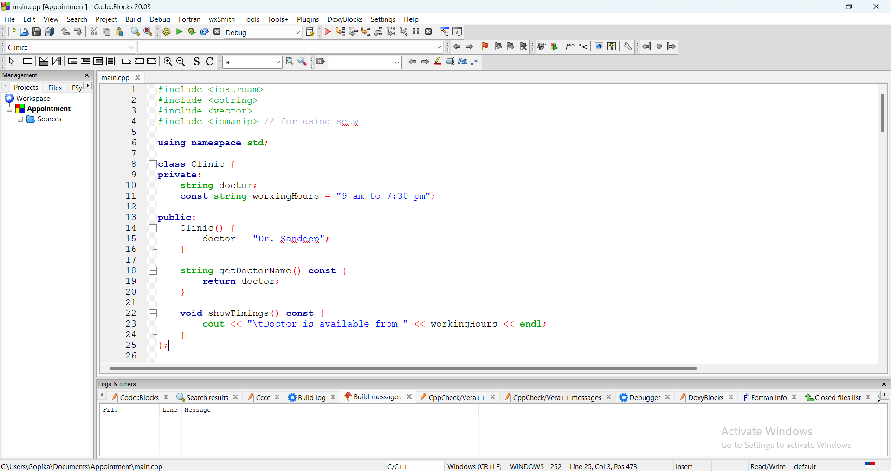
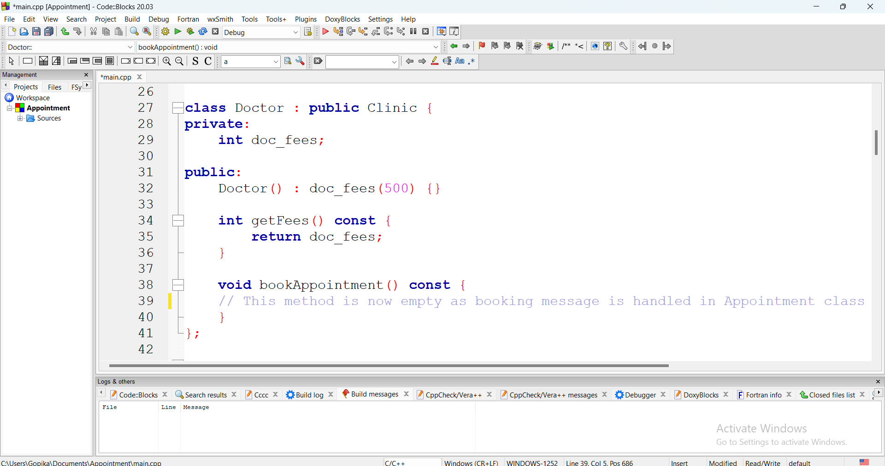
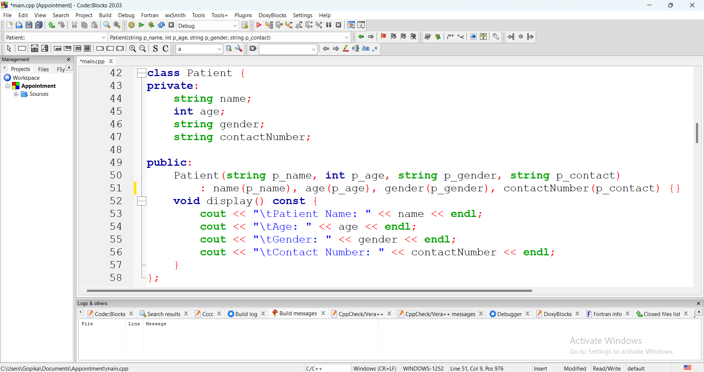
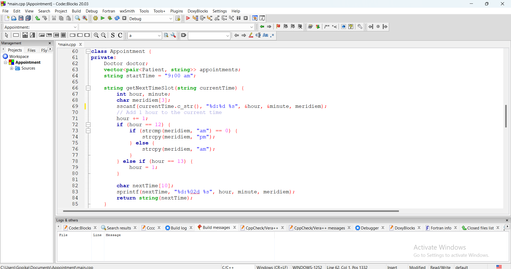
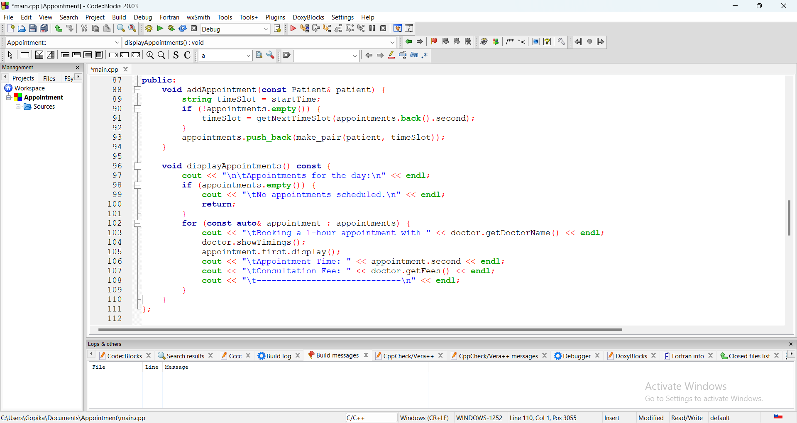
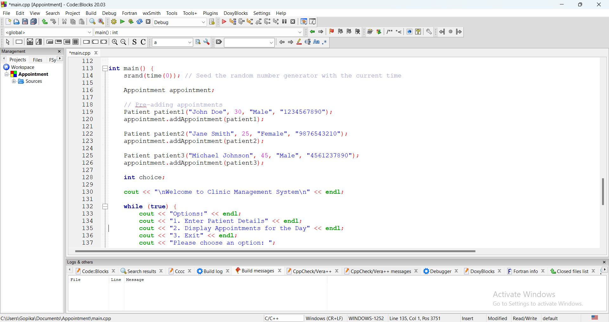
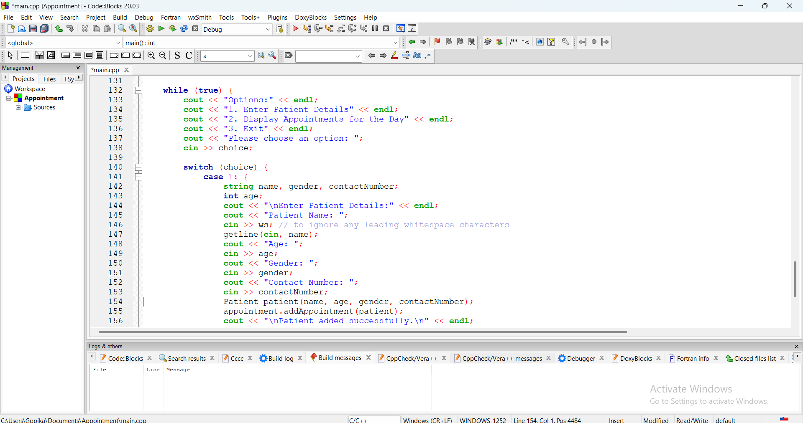
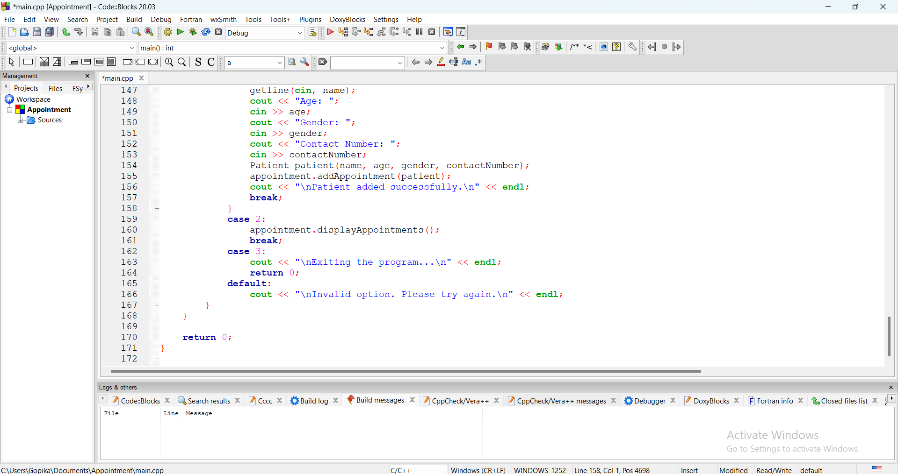
## Output:

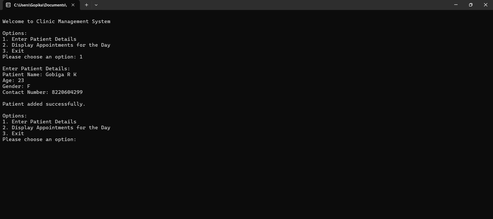
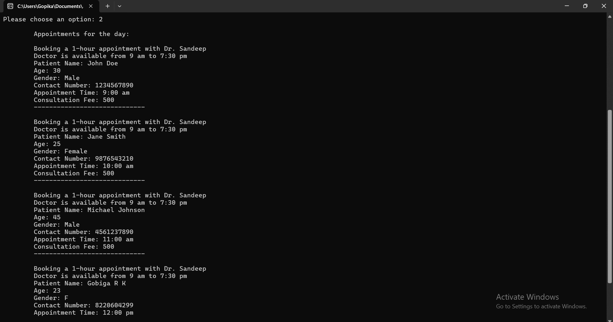
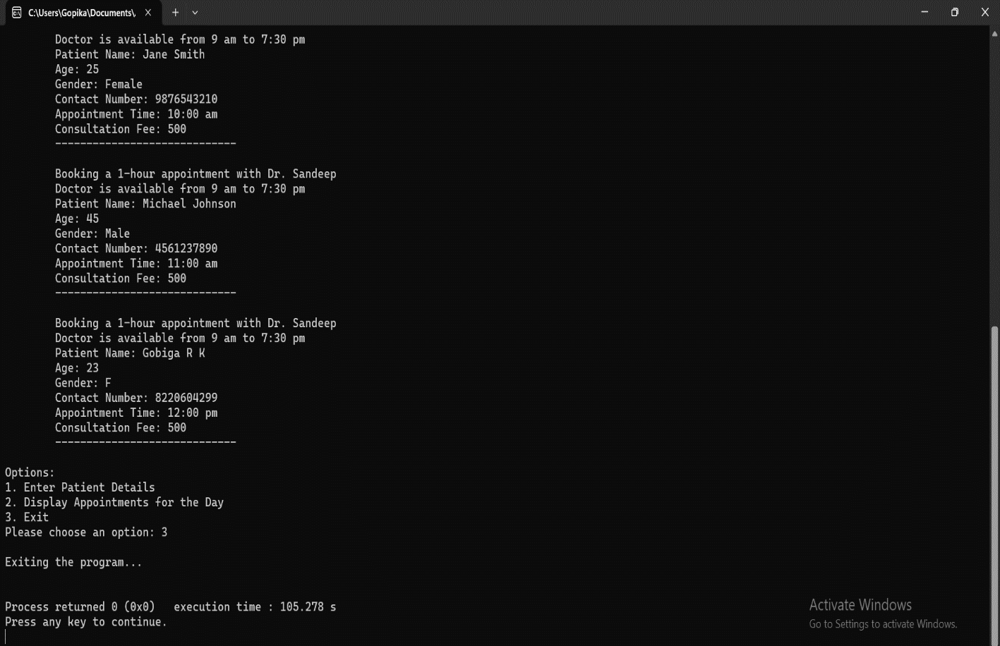
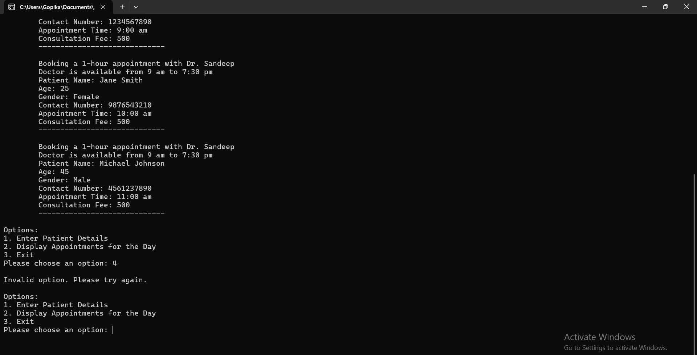

## Conclusion
The clinic management system efficiently handles appointment scheduling and patient management through a well-structured implementation. By managing appointments, maintaining patient records, and providing clear doctor and clinic details, it contributes to operational efficiency and improved patient satisfaction.

## Future Enhancements
- Implement a notification system via email, SMS, or app notifications.
- Integrate with EHR systems to maintain comprehensive patient records.
- Support multiple doctors and enhance scheduling for different specialties.

